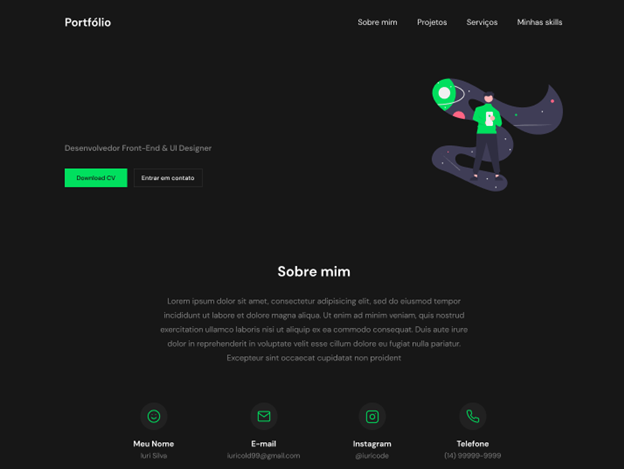
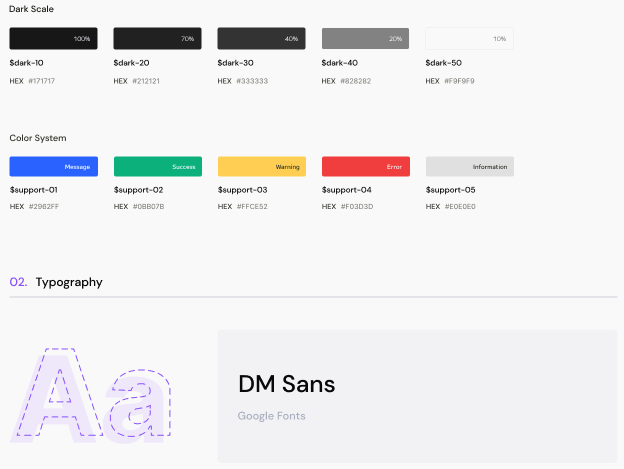

<h1> 📚 Projeto Portfólio </h1>  

Neste projeto irei desenvolver o meu portfólio para salvar os projetos desenvolvidos em sala de aula e até mesmo projetos pessoais!
 

Este projeto consiste na criação de uma landing page, com menus utilizando HTML e CSS: 
<ul>
  <li>Sobre mim</li>
  <li>Projetos</li>
  <li>Serviços</li>
  <li>Minhas Skills</li>
</ul> 

No portfólio irei desenvolver conteúdos relacionados com minhas habilidades profissionais:  : 
<ul>
  <li>Redes de Computadores</li>
  <li>Manutenção em Desktop e Notebook</li>
  <li>Desenvolvimento Front-End</li>
  <li>Backup em Nuvem</li>
</ul>  

Metodologia de avaliação:  : 
<ul>
  <li>Segui as estruturas semânticas HTML</li>
  <li>Utilizei sintaxe vebosa</li>
  <li>Realizei a criação do README.md no github</li>
  <li>Anexei os links dos projetos na página do portfólio</li>
</ul>

  

Front-End do Projeto:  : 

   

 
       

 

Tipografia Utilizada:  : 
 

 

        

## 🤝 Faça sua Contribuição 

Esse repositório foi criado com o objetivo de estudar e aprimorar os conhecimentos em HTML5 e CSS3. Gostaria de convidá-los (as) a contribuir para o projeto, afinal, juntos podemos criar algo ainda melhor!

Caso tenha encontrado algo que tenha sido útil para você, ficarei muito feliz em saber que o meu trabalho está sendo útil para outras pessoas. Compartilhe também com seus amigos e conhecidos que possam se interessar pelo conteúdo.

Agradeço por sua visita e espero que possamos continuar a evoluir juntos!

 

 ## Se possível

    
- 🐛 Encontre e relate issues para que possamos corrigir eventuais bugs e melhorar a experiência do usuário.  

- ⭐️ Se gostou do nosso trabalho, por favor, considere dar uma estrela ao projeto. 

- 🤝 Sua contribuição é muito importante para nós e nos ajuda a continuar evoluindo. Agradecemos a sua visita e esperamos contar com a sua ajuda para tornar o projeto ainda melhor!

 

Desenvolvido por [Raphael Perdigão](https://www.linkedin.com/in/raphaelpagniperdigao/).  😜

<a href="https://www.sysgaya.com.br/">Visite o meu site e explore todos os meus serviços</a>

